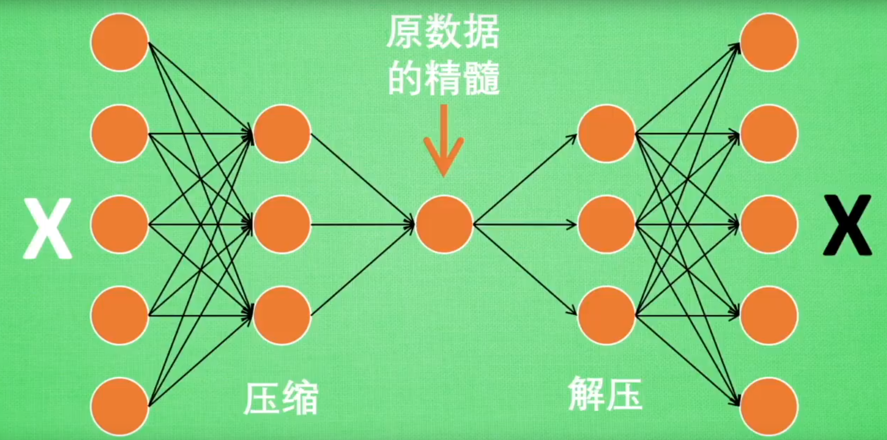

# 数据预处理

## 数据清洗

### 重复值

```python
# 一般处理方式，删除
df.drop_duplicates(inplace=True)
```

### 缺失值

```python
# 判断缺失值
df.isnull() 
...
```

1. 删除法

    当观测的比例低于5%，删除；当特征的缺失85%

2. 替补法

    对于连续变量，中位数替换；离散变量，众数替换；前一个值，后一个值替换；常数替换

3. 插补法

    回归插补法；k近邻插补法；拉格朗日插补法

### 异常值

1. 删除法，观测数不能太多

2. 替换法

    2.1 n个标准差法

    2.2 箱线图判别法

    2.3 均值

    2.4 中位数

    ...

## 数据预处理

### 聚集与抽样

#### 聚集

OLAP

#### 抽样

1. 简单随机抽样(包括有放回、无放回、分层抽样)
2. 渐进抽样

### 特征创建

#### 特征提取

如云帆加速的User-Agent提取新特征

#### 特征构造

一个或多个特征构建一个新特征

#### 映射新空间

傅里叶变换

小波变换

### 变量变换

#### 非线性变换

简单函数$log_x$

#### 规范化或标准化

缩放为$[-1,1]$

#### 重编码

1. $onehotencoder$ 独热编码

    ```python
    sklearn的onehot
    pandas的get_dummies
    ```

2. $label_binarize $ 二值化编码

3. $labelencoder$ 标签编码


# 特征工程

### 特征选择

#### 经验法


#### 包装法


#### 过滤法


#### 嵌入法

### 降维

#### $PCA$(主成成因分析)


#### $LDA$


#### $SVD$(奇异值分解)

# 算法-回归与分类

## 朴素贝叶斯


## SVM 

## KNN

## 线性回归

### 一元回归

#### 原理

$y = a + bx + \xi$

a为模型的截距项, b为模型的斜率项,$\xi $为模型的误差项。

### 多元分类

#### 原理

$y = \beta_0 + \beta_1x_1 + \beta_2x_2 + ...+ \beta_px_p + \xi \\$

#### 回归模型的假设检验


### 岭回归与LASSO回归

### Logistic

## 决策树

<font color='yellow'>强解释性</font>

### 原理 

决策树是一种类似于流程图的树结构，其规则就是if...else...思想。

### 算法

| 算法 | 提出         | 适用性    |        |
| ---- | ------------ | --------- | ------ |
| ID   |              | 分类      | 多分支 |
| C4.5 |              | 分类      | 多分支 |
| CRAT | 1984 Breiman | 分类/回归 | 二分支 |


#### ID3 信息增益

引入熵的概念: 香农将其引申到信息论领域，用来表示信息量的大小。信息量越大，对应的熵值就越大，反之分类越纯净。

1. (信息)熵的计算公式:

$H(p_1,p_2...P_k) = -\sum\limits_{k=1}^k{p_k}{log_2{p_k}}$ 

2. 经验信息熵

$H(D) = - \sum\limits_{k=1}^k\frac{|C_k|}{|D|}{log_2 \frac{|C_k|}{|D|}}$ 

举例: 以产品被购买案例

3. 条件熵

    条件熵不等同于条件概率，它是一只事件各取值下条件熵的期望

$H(D|A) = - \sum\limits_{i, k}{P(A_i)}{H(D_k|A_i)} = - \sum\limits_{i=1}^n\frac{|D_i|}{|D|}\sum\limits_{k=1}^k\frac{|D_{ik}|}{|Di|}{log_2 \frac{|D_{ik}|}{|D_i|}}$

4. 信息增益

$Gain_A(D) = H(D) - H(D|A)$


缺点：即信息增益会偏向于取值较多的字段。就是一个字段中的熵越大，就会越偏向。

#### C4.5 信息增益率

在信息增益的基础上进行相应的惩罚，

$Gain_-Ratio_A(D) = \frac{Gain_A(D)}{H_A}, H_A为事件A的信息熵，事件A的取值越多, Gain_A(D)可能越大，但同时H_A也会越大。$


#### CRAT 基尼指数

基尼指数值: 

$Gini(p_1, p_2,...p_k) = \sum\limits_{k=1}^k{p_k(1 - p_k)} = 1 - \sum\limits_{k=1}^k{p_k}^2 =1 - \sum\limits_{k=1}^k\frac{|C_k|}{|D|}^2$

条件基尼指数

$Gini_A(D) = \sum\limits_{i, k}{P(A_i)}{Gini(D_k|A_i)} = \sum\limits_{i=1}^2p\frac{|D_i|}{|D|}\sum\limits_{k=1}^k(\frac{|D_{ik}|}{|Di|})^2$

与信息增益类似，还需要考虑自变量对因变量的影响程度，即因变量的基尼指数下降速度快慢，下降的越快，自变量对因变量的影响就越强，可以用一下公式衡量

$\Delta Gini(D) = Gini(D) - Gini_A(D)$

### 决策树的剪枝

建模过程中可能存在过拟合的情况，在训练集上有很高的精度，在测试集上效果却不够理想。为了解决过拟合，通常会采用剪枝的方式。

#### 预剪枝

这个会在sklearn中调参数进行体现。

```python
# 分类
tree.DecisionTreeClassifier(criterion= 'gini',
                                    splitter= 'best',
                                    max_depth= None, # 最大层数
                                    min_samples_split= 2,
                                    min_samples_leaf= 1, 
                                    min_weight_fraction_leaf= 0.0,
                                    max_features= None,
                                    random_state= None,
                                    max_leaf_nodes= None,
                                    min_impurity_decrease= 0.0,
                                    min_impurity_split= None,
                                    class_weight= None,
                                    presort= False,
                                    )
# 回归
tree.DecisionTreeRegressor(criterion= 'mse')
```

##### 网格搜索法

```python
# 预设一个参数集合，用户可以快速进行参数组合下的试错
from sklearn.model_selection import GridSearchCV

# 1. 预设参数
max_depth = [2, 3, 4, 5, 6]
min_samples_split = [2, 4, 6, 8]
min_samples_leaf = [2, 4, 8, 10, 12]

parameters= {
    'max_depth': max_depth,
    'min_samples_split': min_samples_split,
    'min_samples_leaf': min_samples_leaf,
}

# 2. 网格搜索
grid_dtcateg = GridSearchCV(
	estimator= tree.DecisionTreeClassifier(),
    param_grid = parameters,
    cv= 10, # 10重交叉验证
)
```


#### 后剪枝

##### 误差降低剪枝法

##### 悲观剪枝法

##### 代价复杂度剪枝法


### 案例

```Python
1. 消费者是否购买的信息表
```


## 集成学习

### Bagging与Boosting区别


Bagging 和Boosting都是模型融合的方法，可以将弱分类器融合之后形成一个强分类器，而且融合之后的效果会比最好的弱分类器。

Bagging：

```Python
# Bagging方法即套袋法,算法过程如下：
1. 从原始样本集中抽取训练集. 每轮从原始样本集中使用Bootstraping方法抽取n个训练样本(在训练接种, 有些样本可能被多次抽到, 而有些样本可能一次都没有抽中). 共进行K轮抽取, 得到K个训练集. (K个训练集之间是相互独立的)
2. 每次使用一个训练集得到一个模型, K个训练集共得到K个模型. (注: 这里并没有具体的分类算法或回归算法, 我们可以根据具体问题采用不同的分类或回归方法, 如决策树、感知机)
3. 对分类问题: 将上步得到的K个模型采用投票的方式得到分类结果; 对于回归问题, 计算上述模型的均值作为最后结果. (所以模型重要性相同)
```

Boosting：

```Python
AdaBoosting方式每次使用的是全部的样本，每轮训练改变样本的权重。下一轮训练的目标是找到一个函数f 来拟合上一轮的残差。当残差足够小或者达到设置的最大迭代次数则停止。Boosting会减小在上一轮训练正确的样本的权重，增大错误样本的权重。（对的残差小，错的残差大）
梯度提升的Boosting方式是使用代价函数对上一轮训练出的模型函数f的偏导来拟合残差。
```

区别：

|          | Bagging                          | Boosting                                                     |
| -------- | -------------------------------- | ------------------------------------------------------------ |
| 样本选择 | 有放回选取,各个训练集之间独立    | 每一轮的训练集不变，只是训练集中每个样例在分类器中的权重发生变化<br />权值是根据上一轮分类结果进行调整 |
| 权重     | 使用均匀取样，每个样例的权重相等 | 根据错误率不断调整样例的权值，错误率越大则权重越大           |
| 预测函数 | 所有预测函数的权重相等           | 每个弱分类器都有相应的权重，对于分类误差小的分类器会有更大的权重 |
| 并行计算 | 各个预测函数可以并行生成         | 各个预测函数只能顺序生成，因为后一个模型参数需要前一轮模型的结果 |
|          |                                  |                                                              |

### randomForest

### Adaboost

### GBDT

### XGBoost

### LightBGM


# 算法-聚类

## Kmeans


## DBSCAN

## 层次聚类

# 算法-关联分析

## 关联规则的强度标准


# 神经网络

## CNN 卷积神经网络 

应用：图片识别、自然语言处理、语言识别


## RNN 循环神经网络

应用：写学术论文，写程序脚本，作曲


### LSTM 长短期记忆

普通RNN无法解决梯度消失与梯度爆炸问题。


## Autoencoder 自编码

作用：用来处理无监督学习。它不是条形码、二维码还有图片马赛克。自编码可以像PCA一样给特征降维，有时候还会超越PCA。

先给图片打码，然后再还原。



应用场景：有些高清图片需要上传，但是太大，压缩后，保留关键信息，再还原。


## model Save&Load

保存和加载已经学习好的神经网络

```python
from keras.models import load_model
```


# 模型评估


## 过拟合和欠拟合

### 过拟合

#### 表现形式

模型在测试集上表现很差。问题在于模型已经不适用于新的数据，从而导致模型的泛化能力变差。(简单理解就是训练样本的输入和期望输出基本一致，但是测试样本的输入和输出相差却很大，为了得到一致性假设而使假设变得过渡复杂。)

#### 解决方案

1. 重新清洗数据

    数据不纯

2. 增加训练集数量

    训练集数量不能太小

3. 使用正则化参数控制模型的复杂度

### 欠拟合

#### 表现形式

欠拟合指的是模型在训练和预测时表现都不好的情况。一个欠拟合的机器学习模型不是一个良好的模型并且由于在训练数据上表现不好这是显然的。

1. 添加其他特征项(特征选择)

    1.1 组合

    1.2 泛化

    1.3 相关性

2. 添加多项式特征

    将线性模型通过添加二次项或者三次项使模型泛化能力更强

3. 减少正则化参数

4. 采用dropout方法，应用于神经网络

# 正则化

### L0

### L1

### L2

奥卡姆剃刀

是指向量各元素的平方和然后求平方根。

## 混淆矩阵

混淆矩阵评估模型的好坏，一般会选择准确率指标Accuracy、正例覆盖率指标$Sensitivity$和负例覆盖率指标$1 - Specificity$。这三个指标越高，说明模型越理想。

```python
from sklearn.metrics import confusion_matrix
```


## ROC

- [x] 决策树 
- [x] 随机森林

ROC曲线通过可视化的方法实现模型好坏的评估，它使用两个指标值进行绘制，其中$x$轴为$1 - Specificity$，即负例错判率；$y$轴为$Sensitivity$，即正例覆盖率。

ROC组合点的计算(略)

图(需要添加)

通过绘制ROC曲线，可以得出折线下的面积，就是图中着色部分，这个面积成为AUC。在做模型评估的时候AUC的值越大越好，通常情况下，当AUC在$0.8$以上时，这个模型就可以接受了。sklearn模块中提供了函数为roc_curve，在子模块metrics中。(模型的拟合度算比较理想了)

```python
from sklearn.metrics import roc_curve
```


## K-S曲线

具体步骤: 

1. 按照模型计算的Score值,从大到小排序；

2. 取出10%，20%，...90%所对应分数位，并以此作为Score的阈值，计算$Sensitivity$和$1 - Specificity$的值；

3. 将10%，20%，...90%所对应分数位点用作绘图$x$轴，将$Sensitivity$和$1 - Specificity$两个指标值用作绘图的$y$轴，进而得到两天曲线。

    需要自定义函数


# 面试

## 算法问题

### 01 KNN和Kmean的区别？

#### 01 KNN和Kmean的区别？


