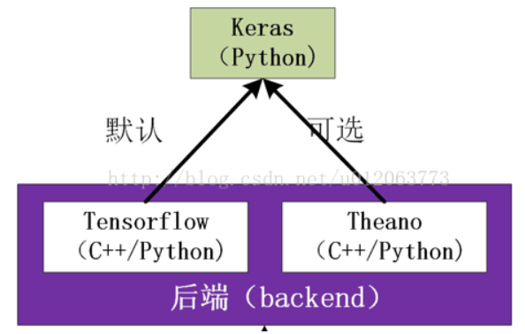

# 使用框架

### TensorFlow

#### 简介

##### 是什么

TensorFlow 是Google开发的一款神经网络的Python外部结构包，也是一个采用数据流图来进行数值计算的开源软件库。TensorFlow让我们可以先绘制计算结构图，也可以称是一系列可人机交互的计算操作，然后把编辑好的Python文件转换成更搞笑的C++，并在后端进行计算。

##### 为什么要用

1. TensorFlow被认定为神经网络中最好用的库之一
2. 擅长的任务就是训练深度神经网络
3. 降低深度学习的开发成本和难度
4. 开源

### Theano

#### 简介

##### 是什么

Theano 是神经网络的Python机器学习的模块，TensorFlow基于Theano进行了很多升级改进。

##### 为什么要用

1. 有些教程使用Theano写的

### keras

#### 是什么

Keras是一个由Python编写的开源人工神经网络库，可以作为Tensorflow、Microsoft-CNTK和Theano的高阶应用程序接口，进行深度学习模型的设计、调试、评估、应用和可视化 [1]  。Keras在代码结构上完全由面向对象方法编写，高度模块化并具有可扩展性，其调用机制和说明文档有将用户体验和使用难度纳入考虑，简化了很多复杂算法的实现难度 [1]  。Keras支持现代人工智能领域的主流算法，包括前馈结构和递归结构的深度神经网络，也可用和参与构建统计学习模型。

#### 为什么要用

1. Keras 是对Theano进行了包装

2. 兼容Theano和Tensorflow，适用于windows、macos、linux

3. 兼容backend

    Keras是基于两个Backend，一个是Theano，另一个是TensorFlow(默认的后端)。使用的时候需要更改配置。

    

    

