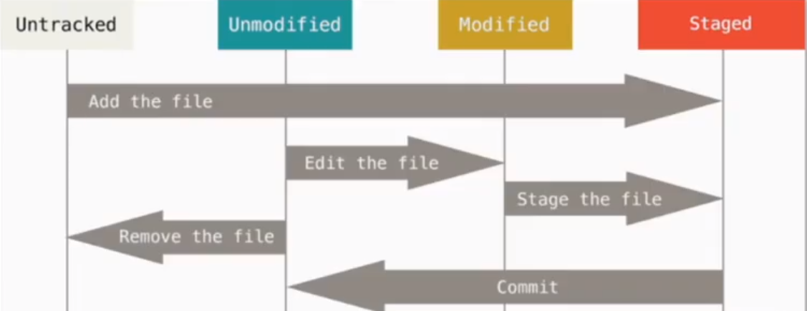
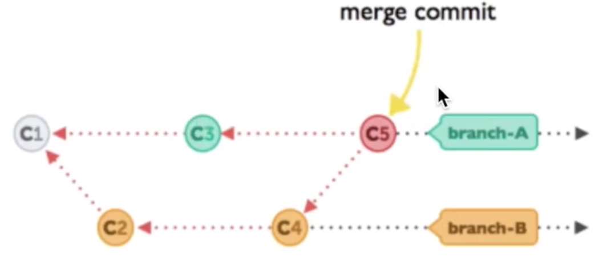

## 安装

### linux

```python
# Ubuntu
apt-get install git
# Centos
yum install git
```


## 第一个版本库Repository

git 文件管理流程



身份验证

```python
"""身份验证/管理"""
# 创建用户
git config --global user.name "VikenBrain"
git config --global user.email "18629242021@163.com"
# 查看用户
git config user.name
git config email
```

创建

```python
# 初始化, 创建.git文件夹
git init
git status
	-s 缩写状态
# 添加文件
git add 1.py
# 提交
git commit -m "change 1"
# 推送
git -u origin master
git push

git commit -am "" # 文件已经存在，add和commit合并
```

## 记录修改(log & diff)

```python
# 日志
git log
	--oneline # 查看提交记录，显示之前log
# 查看文件的不同
git diff
	--cached # 一个Staged状态
    HEAD # 查看修改状态
```

## 回到过去(reset)

### 回到add-commit之前所有文件

```python
"""回到过去"""
# 修改文件了
git add 1.py 
git status -s
git reset 1.py # Unstaged changes after reset

git reset --hard HEAD # 回到上一个版本
git reset --hard HEAD~2 # 回到上上一个版本
	或者 git reset --hard HEAD 2a17846(或者指针) # 版本号
    
"""回到未来"""
git reflog # 查看之前的操作
git log --oneline

```

### checkout 针对单个文件

```python
git checkout c6762a1 --1.py 
git add 1.py # 单个文件被修改
```

## 分支(branch)

```python
# 查看带分支
git log --oneline --graph
# 建立分支
git branch dev
	-b # 建立分支并移动指针到分支上面去
git branch  # 查看分支

git checkout dev # 切换分支
git branch -d dev # 删除分支，前提是切换回master
```


### merge 

将分支合并到主分支

```python 
# 指针在主分支上
git merge --no-ff -m "keep merge info" dev
```

#### merge 分支冲突




主分支已经被修改

```python
# 冲突标志
CONFLICT(content)：

# 查看冲突，解决后
git commit -am "solve conflict" # 合并

# 解决标志
solve conflict
```

### rebase

主分支已经更改，分支想要合并到新的主分支。(这是一个很危险的东西)


### stash

临时修改，场景是: 突然接到一个需求，手头的东西还没有做完，又不想把两个commit在一起。

1. 暂存修改

2. 做其他任务

    ```python
    git status -s
    git stash # 放在缓存区
    git checkout -b newtest # 重新建立一个分支
    git commit -am "new job from Viken"
    git merge --no-ff -m "merged" newtest
    git commit -am "solve conflict" # 合并
    ```

3. 恢复暂存

    ```python
    git branch -D ew_test # 删除分支
    git stash pop # 拿回暂存
    ```

    

## 在线仓库连接

### github

1. 建立github版本库
2. 连接本地版本库
3. 推送修改

### gitlab

### 码云


