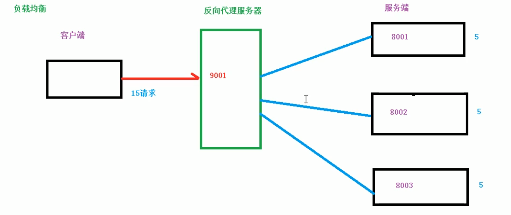
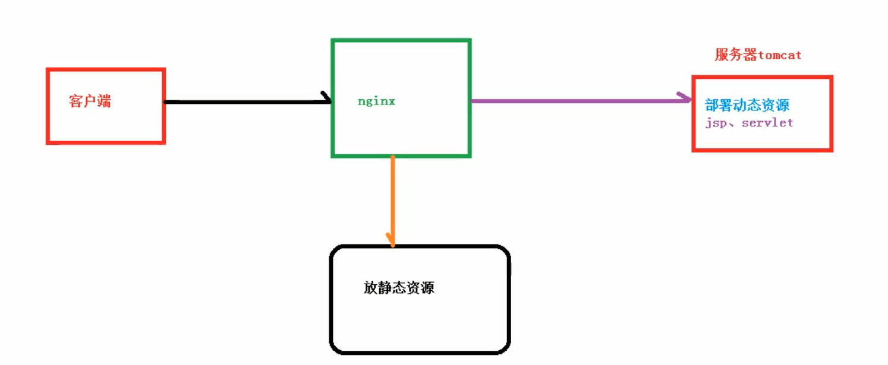

## 1 基本概念

### 1.1 nginx是什么，做什么事情

一个高性能的HTTP和反向代理服务器，特点是占有内存少，并发能力强，报告表明支持50000个并发。

### 1.2 反向代理

#### 1.2.1 正向代理

需要配置代理服务器


#### 1.2.2 反向代理

我们只需要将请求发送到反向代理服务器，有反向代理服务器去选择目标服务器获取数据后，返回给客户端，此时反向代理服务器和目标服务器对外就是一个服务器，暴露的是代理服务器地址，隐藏了真实服务器IP地址。


### 1.3 负载均衡

单个服务器解决不了，我们增加服务器的数量，然后将请求分发到各个服务器上，将原先请求集中到单个服务器情况改为将请求分发到多个服务器上，将负载分发到不同服务器，也就是我们所说的负载均衡。(加服务器)



### 1.4 动静分离

为了加快网站的解析速度，可以把动态页面和静态页面由不同的服务器来解析，加快解析的速度。将是原来单台服务器的压力。


动静分离方式: 



## 2 nginx 安装、常用命令和配置

### 2.1 linux 系统中安装nginx

```python
# 默认安装目录
/usr/local/nginx
# 启动目录
/usr/local/nginx/sbin   
nginx # 启动

# 查看nginx启动端口
ps -ef | grep nginx
```

#### 2.1.1  安装依赖

```python
yum install gcc-c++
yum install pcre pcre-devel
yum install openssl openssl-devel
```

#### 2.1.2 安装nginx

https://nginx.org/download/

```python
tar -zxvf nginx-1.16.1.tar.gz
cd nginx-1.16.1
./configure
make && make install
```

#### 2.1.3 配置防火墙

版本一:（没用过）

```python
# 查看开放的端口号
firewall-cmd --list-all
# 设置开放的端口号
firewall-cmd --add-service=http --permanent
sudo firewall-cmd --add-port=80/tcp --permanent
# 重启防火墙
firewall-cmd --reload
```

版本二:（aliyun 配置成功）

服务器开放安全组 -- 开放端口

```python
 配置Nginx环境变量
    vim /etc/profile
    ...
    // Nginx
    PATH=$PATH:/usr/local/nginx/sbin
    export PATH
    // 运行
    source /etc/profile 
    nginx -v # 查看版本
4 配置Nginx.conf 文件
    vim /usr/local/nginx/conf/nginx.conf
    ...
    // 添加配置
    server{
      listen  80;  #nginx所监听的ip与端口号(http 80,与阿里云对应)
      server_name  53.140.39.77; # 阿里云服务器公网IP 
       charset  utf-8;  #编码格式
       location  /{
          index index.html index.htm;  #默认页
          root  htmls; #根目录
       }
    }
    // 解决访问不到htmls文件，在这个文件夹中放入index.html 文件(重要)
    ---- 图1
    // 检测配置文件是否有误，再启动Nginx
    ./sbin/nginx -t
5 启动Nginx文件
    5.1 启动nginx
    nginx
    5.2 查看是否启动成功
    ps -ef | grep nginx
    ---- 图2
6 关闭防火墙
    见10其他问题
7 阿里云服务器中设置安全组
    ---- 图3
8 浏览器输入,配置成功
    http://ip
        
# 配置防护墙

Job for iptables.service failed because the control process exited with error cod：

# 启动iPtables:
service iptables start
	出现报错（如上）
# 查看异常信息
journalctl -xe
	Failed to start IPv4 firewall with iptables.	
// 因为 centos7默认的防火墙是firewalld防火墙，不是使用iptables，因此需要先关闭firewalld服务。

关闭firewalld
systemctl stop firewalld  # 停止服务
systemctl mask firewalld  # 注销服务
# 其他命令
systemctl start iptables
systemctl restart iptables
systemctl reload iptables

**使用 iptables服务 **

#开放80端口(HTTPS)
iptables -A INPUT -p tcp --dport 80 -j ACCEPT

#保存上述规则
service iptables save
#开启服务,正常启动
systemctl restart iptables.service
# 设置开机启动
systemctl enable iptables.service
```

#### 2.1.4 其他问题

```python
nginx: [emerg] bind() to 0.0.0.0:80 failed (98: Address already in use) ：
...

原因：是因为Nginx已经启动，如果输入命令nginx重新启动，就会报错。如果想要重新启动：
sudo fuser -k 80/tcp # 杀掉这个端口
```

### 2.2 nginx常用命令

```python
nginx -v
nginx -s -stop # 关闭nginx
nginx
nginx -s reload # 重新加载 
```

### 2.3 nginx 配置文件

#### 2.3.1 文件位置

```python
/user/local/nginx/conf/nginx.conf
```

#### 2.3.2 组成

##### 2.3.2.1 全局块

从配置文件开始到events块之间的内容，主要会设置一些影响nginx服务器整体运行的配置指令，主要包括配置运行nginx服务器的用户(组)、允许生成的worker process数，进程PID存放的路径、日志存放路径和类型以及配置文件的引入等。

```python
# 并发处理服务的关键配置,worker_processes 值越大, 可以支持的并发数量也越多, 但是会受到硬件、软件等设备的制约。
worker_processes 1; 
```

##### 2.3.2.2 events块

```python
# 涉及的指令主要影响nginx服务器与用于的网络连接
events {
    worker_connections  1024; # 最大连接数1024
}
```

##### 2.3.2.3 Http块

nginx配置最频繁的地方

###### http全局块

包括文件引入、MIME-TYPE定义、日志自定义、连接超时时间、单链接请求数上限等；

```python
include       mime.types;
default_type  application/octet-stream;

#log_format  main  '$remote_addr - $remote_user [$time_local] "$request" '
#                  '$status $body_bytes_sent "$http_referer" '
#                  '"$http_user_agent" "$http_x_forwarded_for"';

#access_log  logs/access.log  main;

sendfile        on;
#tcp_nopush     on;

#keepalive_timeout  0;
keepalive_timeout  65;

#gzip  on;
```

###### server块

```python
server {
        #nginx所监听的主机名称与端口号
        listen       80;
        server_name  8.129.237.145;

        #编码格式
        charset utf-8;

        #限制上传文件大小
        client_max_body_size 50M;

        #access_log  logs/host.access.log  main;

        location / {
            root   /usr/local/aimilitary/vue-509/; #前端根目录
            index  index.html index.htm;   #默认页
            try_files $uri $uri/ /index.html; #解决刷新页面时显示404
        }

        location /api/ {
            proxy_pass http://127.0.0.1:7001/;
            proxy_set_header Host $host:$server_port;
        }

        location /public/details/ {  #代理所有静态资源文件
            root  /usr/local/aimilitary/egg-509/app/; #静态资源地址，本地路径
        }
        #error_page  404              /404.html;

        # redirect server error pages to the static page /50x.html
        #
        error_page   500 502 503 504  /50x.html;
        location = /50x.html {
            root   html;
        }
}
```

## 3  配置实例1-反向代理

P10 暂停

https://www.bilibili.com/video/BV1zJ411w7SV?p=10&spm_id_from=pageDriver

## 4 配置实例2-负载均衡

## 5  配置实例3-动静分离

## 6 配置高可用集群

## 7 nginx 原理


### smartchart

```python

    
    server {
        #nginx所监听的ip与端口号
        listen       9000;
        server_name  8.129.237.145;
        
        #编码格式
        charset utf-8;
        
        #限制上传文件大小
        client_max_body_size 50M;
       
        #access_log  logs/host.access.log  main;

        location / {
            include uwsgi_params; # 加载uwsgi_params
            uwsgi_connect_timeout 30; # 连接的超时时间 不要加冒号不要加冒号不要加冒号 
            uwsgi_pass unix:/opt/script/uwsgi.sock; uwsgi.sock # 通讯的文件地址
        }

        location = /static/{
            alias /usr/local/smartchart/smartchart/static; # 静态文件的目录
            index index.html index.htm;
        }

    }
```

```python
# smartchart 可视化项目
server {
    listen 9000; # 我要监听那个端口
    server_name 8.129.237.145; # 你访问的路径前面的url名称ip地址也可以
    pid        /var/run/nginx.pid;    #进程文件
    error_log  /var/log/nginx/error.log; #错误日志定义等级，[ debug | info | notice | warn | error | crit ]
    access_log /var/log/nginx/access.log main; # Nginx日志配置
    charset utf-8; # Nginx编码
    gzip_types text/plain application/x-javascript text/css text/javascript application/x-httpd-php application/json text/json image/jpeg image/gif image/png application/octet-stream; # 支持压缩的类型

    # 指定项目路径uwsgi
    location / { # 这个location就和咱们Django的url(r'^admin/', admin.site.urls),
        include uwsgi_params; # 导入一个Nginx模块他是用来和uWSGI进行通讯的
        uwsgi_connect_timeout 30; # 设置连接uWSGI超时时间
        uwsgi_pass unix:///usr/local/smartchart/script/uwsgi.sock; # 指定uwsgi的sock文件所有动态请求就会直接丢给他
    }

    # 指定静态文件路径
    location /static/ {
        alias /usr/local/smartchart/smartchart/static/;
    }
}
```

```
uwsgi --socket 172.30.185.223:9000 --wsgi-file smartchart/wsgi.py
```